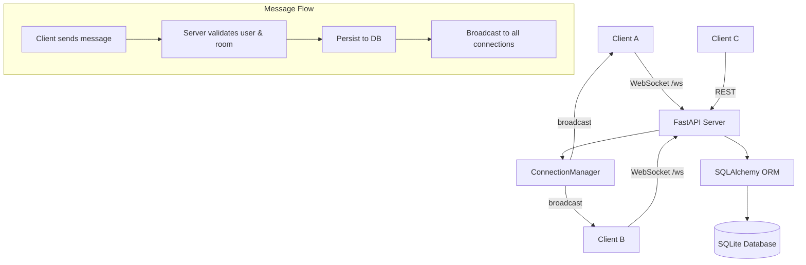

# Real-Time Chat API

A real-time chat API with WebSocket messaging, chat rooms, typing indicators, and presence tracking.

## Features

- **Real-time messaging** via WebSockets — messages broadcast instantly to all connected clients
- **Chat rooms** — create named rooms, join as a member, send messages scoped to a room
- **Typing indicators** — notifies all other connected clients when a user is typing
- **Presence tracking** — online/offline status broadcast when users join or disconnect
- **Message history** — fetch past messages per room with cursor-based pagination

## Tech Stack

- **Python** — language
- **FastAPI** — web framework and WebSocket support
- **SQLAlchemy** — ORM
- **SQLite** — database
- **Pydantic** — request/response validation
- **Uvicorn** — ASGI server
- **Pytest** — testing

## Architecture Overview



**ConnectionManager** holds all active WebSocket connections in memory. When a message arrives, the server validates the user and room against the database, persists the message, then calls `broadcast()` to fan it out to every connected client.

## API Documentation

### REST Endpoints

| Method | URL | Description |
|--------|-----|-------------|
| `POST` | `/users` | Create a new user |
| `POST` | `/rooms` | Create a new room (creator is automatically a member) |
| `POST` | `/rooms/{room_id}/members` | Add a user to a room |
| `GET` | `/rooms` | List all rooms |
| `GET` | `/rooms/{room_id}/messages` | Get message history for a room (paginated) |
| `GET` | `/rooms/{room_id}/members`| List all members of a room

**Query parameters for `/rooms/{room_id}/messages`:**
- `limit` — number of messages to return (default: 20)
- `before` — message ID cursor; returns messages older than this ID

### WebSocket — `ws://localhost:8000/ws`

**Events you send:**

| Type | Payload | Description |
|------|---------|-------------|
| `join` | `{"type": "join", "user_id": 1}` | Register your identity on the connection |
| `message` | `{"type": "message", "user_id": 1, "room_id": 1, "text": "hello"}` | Send a chat message |
| `typing` | `{"type": "typing", "user_id": 1, "room_id": 1}` | Broadcast a typing indicator |

**Events you receive:**

| Type | Payload | Description |
|------|---------|-------------|
| `presence` | `{"type": "presence", "username": "alice", "status": "online"}` | User came online or went offline |
| `typing` | `{"type": "typing", "username": "alice", "room_id": 1}` | User is typing |
| `message` | `{"id": 1, "user_id": 1, "username": "alice", "room_id": 1, "text": "hello", "created_at": "..."}` | New chat message |
| `error` | `{"type": "error", "message": "..."}` | Something went wrong |

## Setup Instructions

**1. Clone the repository**
```bash
git clone <your-repo-url>
cd Real-Time-Chat-API
```

**2. Create and activate a virtual environment**
```bash
python -m venv venv
source venv/bin/activate        # Mac/Linux
venv\Scripts\activate           # Windows
```

**3. Install dependencies**
```bash
pip install -r requirements.txt
```

**4. Run the server**
```bash
uvicorn app.main:app --reload
```

The API will be available at `http://localhost:8000`. Interactive docs are at `http://localhost:8000/docs`.

## Running Tests

```bash
pytest app/test_main.py
```
